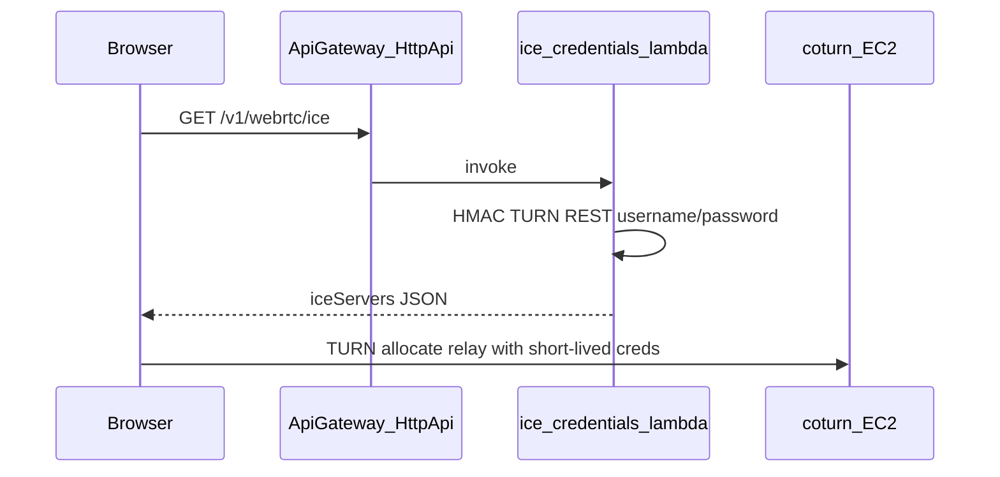

# EC2 coturn + credential API plan

## Goal

Improve mesh WebRTC reliability ([RoomPage.tsx](apps/web/src/pages/RoomPage.tsx)) by adding **in-house TURN** (coturn on EC2) and **time-limited credentials** from your own API—no third-party TURN SaaS.

## Current behavior

- ICE is static: [iceServers.ts](apps/web/src/config/iceServers.ts) reads `VITE_WEBRTC_ICE_SERVERS_JSON` or falls back to Google STUN only.
- [RoomPage.tsx](apps/web/src/pages/RoomPage.tsx) freezes that list once: `useMemo(() => getRtcIceServers(), [])` and passes `iceServers` into every `new RTCPeerConnection({ iceServers })`.

## Architecture

- **coturn** holds a **static auth secret** (`use-auth-secret` in coturn terms).
- **Lambda** holds the **same secret** (from **Secrets Manager**), computes **TURN REST**-style username/password (expiry embedded in username, password = base64(HMAC-SHA1(secret, username)) per the common WebRTC/coturn convention).
- Response shape matches what the browser already expects: `{ iceServers: RTCIceServer[] }` (array of entries with `urls`, and for TURN entries `username` + `credential`).

## 1. EC2: coturn deployment (ops / optional IaC later)

- **Instance**: small general-purpose in the same region as your API users care about; **Elastic IP** so `external-ip` in coturn is stable.
- **Security group** (critical): allow **3478** UDP and TCP; if you enable TLS (`turns:`), **5349** TCP; open coturn’s **relay port range** (e.g. **49152–65535**) for **UDP and TCP** to the instance public IP. Missing relay range is a frequent “TURN still fails” mistake.
- **Host hardening**: restrict SSH source; OS updates; optional **ACM cert** or **LetsEncrypt** if serving `turns:` on 5349.
- **coturn config highlights**:
  - `listening-ip`, `relay-ip`, **`external-ip`** = Elastic IP (and internal if needed).
  - `use-auth-secret` + shared secret string (matches Secrets Manager value).
  - `realm` = your domain (e.g. `turn.riffsync.tv`).
  - Sensible **bandwidth / session** caps to control egress cost.

Document the **public hostname or IP** and **UDP/TURN URL** you will put in Lambda env (e.g. `turn:turn.example.com:3478?transport=udp` and optionally `turns:...:5349?transport=tcp`).

*Note: EC2 can be provisioned manually or as a separate CDK/CloudFormation stack later; the credential Lambda only needs the secret + public TURN URLs.*

## 2. Backend: credential Lambda + HTTP route

**Where to wire**: [api-catalog-stack.ts](infra/cdk/lib/api-catalog-stack.ts) already defines the **HTTP API**, CORS (`GET` allowed), and Nodejs Lambdas (same pattern as [catalog-list.ts](infra/cdk/lambda/catalog-list.ts)).

**Add**:

- **Secret**: e.g. `TurnSharedSecret` in Secrets Manager (JSON or plain string); grant the new Lambda `secretsmanager:GetSecretValue`.
- **Lambda** (new file under `infra/cdk/lambda/`, e.g. `webrtc-ice-config.ts`):
  - Reads secret + env: TURN hostname(s), realm, **TTL** (e.g. 12–24h; shorter if you prefer tighter exposure).
  - Builds `iceServers`:
    - Keep **STUN** entries (public STUN and/or your own) as static env or constant.
    - Append **TURN** / **TURNS** entries with generated `username` / `credential`.
  - Returns `200` + JSON; on misconfiguration return `503` with no secret leakage.
- **Route**: `GET /v1/webrtc/ice` (or `/v1/webrtc-ice`) with **no JWT** (same class as `GET /v1/lobby`) so guests and hosts both get relay without sign-in.
  - Mitigate abuse: **API Gateway throttling**, optional **WAF rate-based rule**, and coturn-side limits.

**Env surface for Lambda** (CDK props): turn URIs template, STUN list, secret ARN, TTL seconds.

## 3. Frontend: async ICE + no stale `RTCPeerConnection`

**Problem**: If ICE loads after the first signaling message, you could create a PC with **STUN-only** and never use TURN for that session.

**Approach**:

- Add a small client helper, e.g. [apps/web/src/config/iceServers.ts](apps/web/src/config/iceServers.ts) or a sibling `fetchRtcIceServers.ts`, that:
  - Calls `GET ${getPublicApiBaseUrl()}/v1/webrtc/ice` when `VITE_PUBLIC_API_BASE_URL` is set.
  - Validates JSON (array or `{ iceServers }` wrapper).
  - On failure or missing API URL: **fallback** to current `getRtcIceServers()` (env STUN / `VITE_WEBRTC_ICE_SERVERS_JSON`).
- In [RoomPage.tsx](apps/web/src/pages/RoomPage.tsx):
  - Replace the static `useMemo` with a **one-shot resolve**: e.g. `iceServersRef` + **`iceServersReady`** promise resolved after first fetch (success or fallback).
  - At the **start** of `ensureHostPeerNegotiated` and at the **start** of the guest `offer` path in `handleGuestSignal`, **`await iceServersReady`** (or read ref after await) before `new RTCPeerConnection`.
  - Keep `onWsMessage` working for **chat/presence** even if ICE fetch is slow; only **PC creation** waits on ICE readiness.

**Types**: extend [vite-env.d.ts](apps/web/src/vite-env.d.ts) only if you add optional `VITE_` toggles (e.g. disable remote ICE in dev); otherwise reuse existing `VITE_PUBLIC_API_BASE_URL`.

**Docs**: update [apps/web/.env.example](apps/web/.env.example) to describe that production ICE can come from the API (and that `VITE_WEBRTC_ICE_SERVERS_JSON` remains an override/fallback for local testing).

## 4. Testing

- **Staging**: deploy EC2 + secret + Lambda; confirm `GET /v1/webrtc/ice` returns TURN entries.
- **Browser**: `chrome://webrtc-internals` — expect **`relay`** candidates for host and guest on a restrictive network (mobile hotspot / VPN).
- **Regression**: with API down, confirm fallback STUN path still behaves as today.

## 5. Cost and ops

- Monitor **EC2 egress** (relay traffic is billed bandwidth).
- Log **Lambda** invocations and **coturn** allocation errors; alert on spikes (possible abuse).

## Key files to touch (implementation phase)

| Area | Files |
|------|--------|
| API | New `infra/cdk/lambda/webrtc-ice-config.ts`, edits to [api-catalog-stack.ts](infra/cdk/lib/api-catalog-stack.ts) |
| Web | [iceServers.ts](apps/web/src/config/iceServers.ts) (or new fetch helper), [RoomPage.tsx](apps/web/src/pages/RoomPage.tsx), [.env.example](apps/web/.env.example) |
| Optional tests | Unit test for HMAC credential derivation in `infra/cdk/lambda/*.test.ts` |
