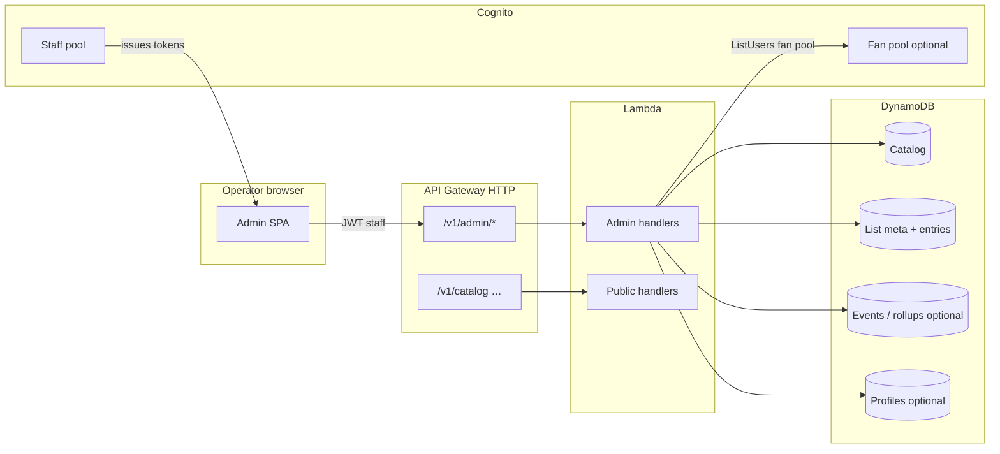

# Operator admin — backend capabilities (draft)

Companion to **`architecture.server.md`**. Covers **authenticated staff** tooling: **registered user directory**, **activity reporting**, **catalog administration**, and **curated lists** (“The Joel Era”, “MST Shorts”, …). **Fan-facing** endpoints (`GET /v1/catalog`, watch parties, optional Facebook login) stay separate.

---

## Principles

| Principle | Meaning |
| --- | --- |
| **Separate trust boundary** | **Operators** authenticate with **dedicated credentials** — not via the **Facebook** federation path exposed to viewers. Prefer a **distinct Cognito app client / user pool partition** or a **staff-only pool** whose users are **invite-only**, with **MFA** where practical. |
| **Least privilege** | Admin Lambdas get **`cognito-idp:ListUsers`**, Dynamo **`UpdateItem`** on catalog, etc.; **never** blanket `dynamodb:*`. Public-route Lambdas must **not** import admin IAM roles. |
| **Audit trail** | **Mutations** that change catalog rows or curated lists emit **structured audit events** (who, what, correlation id); store in Dynamo, **CloudWatch Logs**, or **EventBridge** so you can answer “who moved this episode?” later. |

---

## Authentication & authorization

1. **`/v1/admin/*`** routes **only** behind an **HTTP API JWT authorizer** pinned to **Cognito** (**staff pool** or **`admin`/`curator`** **Cognito group** claims on tokens that **cannot** be issued by your public app client unless you consciously share one pool — safest pattern: **staff pool + no self-sign-up**).
2. **Optional IP allowlisting** or **VPN** via **VPC + private API** once you graduate from “solo operator” workflows.
3. **Route layout** — keep **same** API Gateway (**prefix** **`/v1/admin`**) until traffic or blast-radius forces a **split** second HTTP API pointing at Lambdas packaged separately.

Claims to map in Lambda context: **`sub`**, **`cognito:groups`**, **`email`**.

---

## Capabilities mapped to backends

### 1) Login & **registered users** directory

| **Need** | **Backend** | **Notes** |
| --- | --- | --- |
| Staff login | Cognito Hosted UI **or** custom form → tokens | Invite-only operators; MFA recommended. |
| **List viewers** signed in via Facebook/auth | **`ListUsers`** / **`AdminGetUser`** (**Cognito IDP API**) from **admin Lambda** | Paginate tokens; throttle; **avoid** dumping PII unnecessarily in UI lists (show **masked `email`/`sub`/username** columns by default). Fan pool only users who opted into identity; anonymous-only users never appear — see **profiles** optional row below if you synthesize pseudonymous accounts. |
| Enriched roster | Optional **`profiles`** items in Dynamo (`PK USER#sub`) keyed by **`sub`** | Sync on **sign-in** or **lazy first admin view** (`lastSeenAt`, `displayName`). Anonymous sessions **omit** registry unless you deliberately map device ids (usually **omit**). |

If you operate **two** pools (**fans** vs **operators**), the **registered users** view reads **fan pool** Cognito APIs with **narrow IAM**.

### 2) **Reporting on activity**

**Default:** **charts, alarms, and product-facing rollups** SHOULD live in **AWS CloudWatch** (**`architecture.server.md`** — **Observability**): **dashboards**, **alarms**, built-in service metrics, and **`PutMetricData` / EMF** custom namespaces (**`RiffSync/…`**). External analytics tools are **optional**, not required for baseline reporting.

| Tier | Sources | Fits |
| --- | --- | --- |
| **Ops + KPIs — primary** | **CloudWatch** (Lambda, API Gateway, Dynamo, **custom business metrics**) | Health, traffic, errors, catalog/reconcile/rooms; **SNS** / PagerDuty via **alarms**. |
| **Event detail *(optional)* ** | **Append-only Dynamo** (**`EVT#`**, time sort key), **EventBridge `PutEvents`**, **streams** | Forensics, audit — aggregate into **`PutMetricData`** so **charts stay in CloudWatch**. |
| **Warehouse *(optional)* ** | **EventBridge archive → S3** + **Athena** | Long-horizon SQL if **Logs Insights** is not enough. |
| **Admin HTTP *(optional)* ** | **`GET /v1/admin/reporting/...`** | Exports / bespoke UI — secondary to **CloudWatch** dashboards. |

**Privacy:** aggregate where possible; store **minimal** identifiers; disclose anything linked to authenticated **`sub`**.

**Cardinality:** do **not** use **`roomId`** / **`sub`** as **high-volume custom metric dimensions** — use **Logs Insights** for per-entity drill-down.

### 3) **Catalog management**

Admin-only **write** APIs that mutate the canonical **catalog Dynamo** items mirrored by public **`GET /v1/catalog`** (or CDN mirror):

- **`POST`**, **`PATCH`**, **`DELETE /v1/admin/catalog/episodes/:id`** (payload shape aligned with **`data/catalog/catalog.schema.json`** plus any Dynamo-only fields documented in **`architecture.catalog-images.md`**).
- **Validation** reuse: same constraints as **`catalog.schema.json`** (or codegen types from schema in Lambdas later).
- **Import**: **`POST /v1/admin/catalog/import`** streaming **multipart** or referencing **S3** versioned uploads for bulk replace — validate on a **copy** of the catalog or in a **non-production** account before overwriting live production data if you fear bad JSON.
- **Cache**: invalidate **ElastiCache** catalogue key + bump **ETag** on **`GET /v1/catalog`** when writers succeed.
- Keep **seed `episodes.json` export** pipeline optional (**ops** script dumps Dynamo → CI comparison) — repo seed stays the **bootstrap** story from **`data/catalog/README.md`**.

### 4) **Curated list management** (“The Joel Era”, “MST Shorts”, …)

Treat **lists** as **first-class data**, not hard-coded front-end filters only.

| **Entity** | **Suggested keys** | **Fields** |
| --- | --- | --- |
| **List meta** | `PK LIST#{slug}`, `SK META` | `title`, `description`/`descriptionMarkdown`, `visibility` (**`public` \| `draft`**), **`sortRule`** (**`manual` \| `experimentNumber`** / …), **`heroImageUrl` optional**, timestamps. |
| **Membership** | `PK LIST#{slug}`, `SK ENTRY#{ordinal}` (`00001`…) **or** `ENTRY#{catalogEpisodeId}` with **`ordinal`** attr | **`catalogEpisodeId`** (references canonical **`id`**) |
| **Public list index** | *n/a* (**`GET /v1/lists`**) | **Published** list titles, slugs, optional cover URLs. |
| **Public list detail** | *n/a* (**`GET /v1/lists/{slug}`**) | Hydrate ordered episode payloads (or **`id`** refs + client merges from catalog). |

**Admin routes:** **`POST`/`PATCH /v1/admin/lists`**, **`PUT /v1/admin/lists/{slug}/order`**, **`POST /v1/admin/lists/{slug}/members`** (add/remove/reorder). Enforce **referential integrity** (episode **`id`** must exist) in Lambda.

**Public catalog** may still expose **`era`** filters; **lists** are **editorial** ordering on top of the same underlying episodes.

---

## Component sketch (admin paths)

---

## Related files

| File | Purpose |
| --- | --- |
| [`architecture.server.md`](architecture.server.md) | Base HTTP + WebSocket + Dynamo; **this doc** extends with **admin** routes and extra tables. |
| [`architecture.frontend.md`](architecture.frontend.md) | Public SPA; add a **separate admin UI** (or `/admin` route behind **feature flag + staff auth** only). |
| [`data/catalog/catalog.schema.json`](../data/catalog/catalog.schema.json) | **Seed** episode shape; **admin catalog writes** should stay compatible with what public clients expect. |
| [`data/catalog/README.md`](../data/catalog/README.md) | Bootstrap JSON vs **Dynamo canonical** story. |

---

## When to split infrastructure

Move **admin** to its **own** HTTP API + Lambdas when **IAM policies** get unwieldy, you need **stricter WAF** rules, or **compliance** wants **no public internet** path to admin Lambdas (private API + VPN). Until then, **`/v1/admin/*`** + **group-scoped JWT** is enough.
