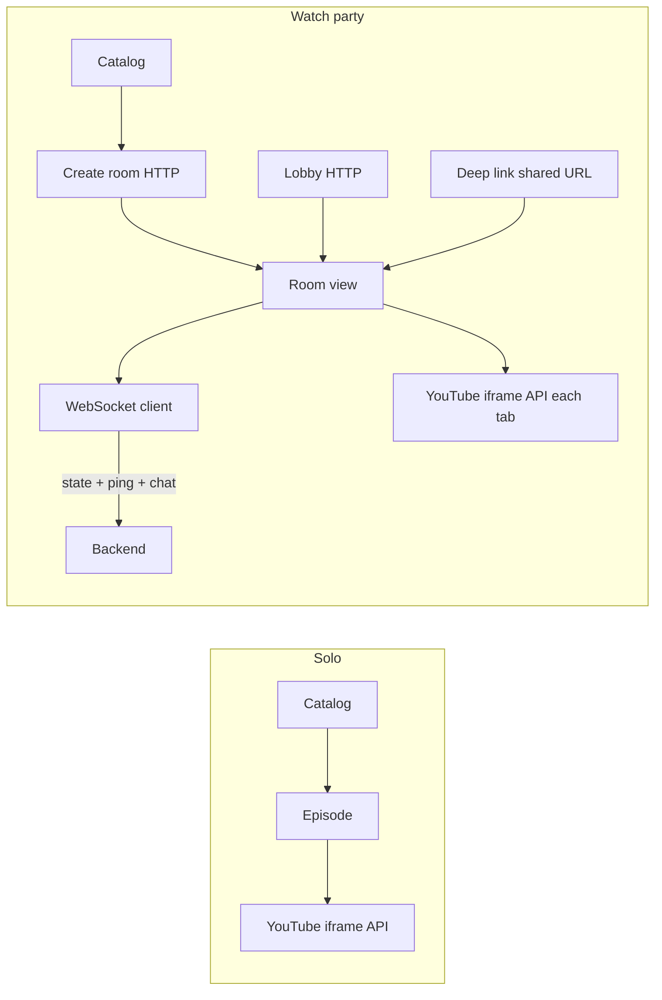

# RiffSync — frontend architecture (draft)

Tracks MVP UI and client behavior aligned with [`README.md`](../README.md) and [`architecture.server.md`](architecture.server.md). Stack is **TypeScript** with **React or Next.js** plus **YouTube iframe / IFrame API** — pin the framework when scaffolding. **Google Cast** (Chromecast-capable devices) is an **optional per-viewer** surface described under **Chromecast / Google Cast** below.

---

## Route map (MVP)

| Route / area | Purpose |
| --- | --- |
| `/` or `/catalog` | Browse curated catalog → **Play** solo or **Start watch party**. |
| `/watch/:catalogId` (example) | **Solo** embedded player — no websocket required for coordination. |
| `/room/:roomId` | Party view: iframe + realtime (sync, chat, presence), host controls vs guest read-only playback UI. |
| `/lobby` (or sidebar on `/`) | List **live public** rooms from HTTP API → join navigates to `/room/:id`. |

Exact path names can change; keep **canonical share URLs** stable once published (`/room/<id>` in README).

## Catalog source (repo + API)

Episode metadata + YouTube **`videoId`** ultimately live in **DynamoDB** (canonical catalog — **[`architecture.server.md`](architecture.server.md)**). During early development **`data/catalog/episodes.json`** is a convenient **seed** for import; after migration the app should always read **`GET /v1/catalog`**, where the API stitches **canonical DB rows** with **TMDB poster/backdrop enrichment** (**[`architecture.catalog-images.md`](architecture.catalog-images.md)**). Until that ships, spikes may load the seed JSON statically and fall back to YouTube thumbnails built from **`youtubeVideoId`**.

---

## Top-level flows

---

## YouTube embedding

- **Official** player only (Iframe API): load by `videoId` from catalog/room snapshot.
- **Autoplay**: expect **explicit user gesture** to start or re-sync (“Tap to sync”) when joining rooms or after policy blocks autoplay.
- **Ads**: app **cannot** detect Premium; show room’s **self-reported** **Premium vs free, ad-supported** badge only — sync may drift when clients see different breaks.
- **Embeddability**: some catalog IDs may stop embedding; UI should signal **playback unavailable** and avoid infinite retry loops.

**Seam:** wrap the player in a small **`PlaybackBackend`** abstraction so future **local/partner** sources plug in behind the same “load / play / seek / listen to time updates” boundary.

---

## Chromecast / Google Cast (per viewer, optional)

**Product intent:** Every viewer may **optionally** send the **same catalog episode** they are watching (solo or in a party) to a **nearby Cast receiver** (Chromecast, Cast-built-in TV, Nest Hub with Cast, etc.). This is **viewer-local**—the host does **not** provide one shared cast for the whole room; each person uses their own sender device and Cast target if they want a TV.

**Implementation directions** (validate against YouTube embed policy and your `origin` registration as you integrate):

1. **YouTube embed controls** — Some iframe configurations expose YouTube’s own **Play on TV / Cast** affordance when Google allows it for embedded players. Prefer this if it appears reliably.
2. **[Cast Web Sender](https://developers.google.com/cast/docs/web_sender)** — Add a RiffSync-level **Cast** control that targets the current `videoId` / watch URL per Google’s sender patterns. Third-party embed + Cast has **client-specific** quirks; prototype in **Chrome** early.
3. **Fallbacks** — When Cast is unavailable (**Safari**, some smart-TV browsers, policy blocks), rely on **inline embed** only; optional **“Open in YouTube app”** escape hatch is product choice.

**Watch-party caveats**

- Room sync is driven from the **IFrame Player** timeline in the browser. Casting often pairs the **sender** with the **receiver** as one YouTube session; **drift vs other party members** may be **larger** than for inline-only viewers. Treat as **best-effort**; optional UI note: *Casting may desync slightly compared to other viewers.*
- **Host authority unchanged** — play/pause/seek still come from the host; Cast devices reflect each viewer’s local player behavior subject to YouTube + Cast.

**Detection:** Only render the Cast affordance when sender support is present (e.g. Cast browser API / framework availability). Never block core playback when Cast is missing.

---

## Identity (anonymous MVP)

On **first** use that needs identity (opening lobby, entering room — product choice):

- Assign **random display name** + generate **opaque `sessionId`** (UUID) persisted in **`localStorage`** (or SessionStorage where appropriate).
- Optionally **persist `displayName`** and allow **reroll** / minor edit later.
- Send **`sessionId`** (and derived **host reclaim** handshake if backend issues a token over HTTP/WebSocket after create-room) per API contract — server maps it to moderation / host checks.

Clearing site data ⇒ **new persona**; acceptable per README.

---

## Realtime WebSocket client

Responsibilities on `/room/:roomId`:

1. **Connection lifecycle** — connect with `roomId` + **`sessionId`**; backoff/reconnect UX; unsubscribe on navigate away.
2. **Periodic ping** — lightweight message on interval so **`lastActivityAt`** stays fresh while idle (coordinate interval with backend).
3. **Inbound events** — apply authoritative **playback state** (time, paused, rate); incoming **chat** and **presence** updates.
4. **Outbound** — host-only: play/pause/seek/rate changes; anyone in MVP: chat; optional presence typing later.

Treat **incoming state application** separately from **YouTube iframe event listeners** so you avoid feedback loops when local user is host.

---

## Playback sync (guest + host drift)

- Everyone runs their **own** iframe; coordination is remote control plus **periodic drift check** (~3–5s): compare iframe `currentTime` and playing state vs server canonical state above a tolerance → **smooth seek or pause**.
- Document that **mixed ad tiers** degrade sync; don’t pretend frame-perfect parity.
- **Casting** (Chromecast / Google Cast) can add **extra** skew between guests because the receiver may buffer separately; same tolerance-based correction applies, but UX may need the disclaimer in **Chromecast / Google Cast**.

---

## Room UI specifics

| Concern | Notes |
| --- | --- |
| **Host vs guest** | Disable transport for guests unless you add “vote to sync” luxury later — MVP: host authoritative. |
| **Chromecast / Cast** | Optional **per-viewer** control (solo + party). No “host casts for everyone” in MVP; hide when Cast sender unavailable. |
| **Share** | **Copy URL** (`/room/:id`), optional Web Share API on capable devices; show **`playbackExpectation`** on share affordance. |
| **Badges** | Lobby row + room header: Premium vs **free, ad-supported** (**honor-system** disclaimer in microcopy optional). |
| **Empty/error** | Stale room, host gone, forbidden — clear copy + redirect to lobby. |

---

## Chat & presence

- Append-only **scrollback** capped (e.g. last N messages) — full history MVP optional.
- **Rate limits** surfaced as toast when server rejects.
- **Presence list** keyed by anonymous display labels; join/leave small system lines optional.

---

## State management (implementation TBD)

Document **chosen** stack here after bootstrap (e.g. React Query + Zustand, or Redux Toolkit, or Next Server Components boundaries). Principle: **network state** for room snapshot + websocket merge; **ephemeral UI** local.

---

## What this doc deliberately defers

- Visual design system / component library selection.
- i18n, a11y audit checklist (add once components exist).
- **Presenter / tab-capture mode** — separate doc if pursued.
- **Tests** layout — mirror `CONTRIBUTING.md` or `README` Testing section once CI exists.

Update this file when routes, event schemas, or storage keys stabilize.
