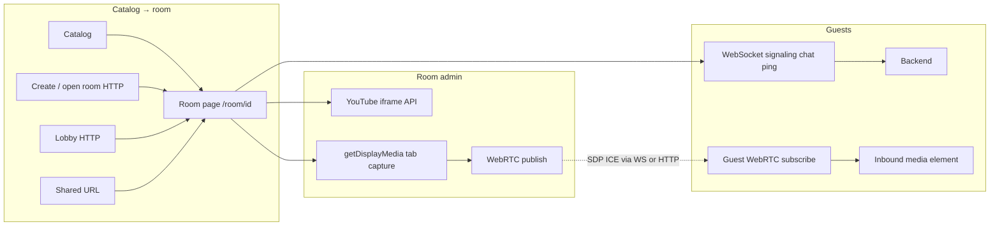

# RiffSync — frontend architecture (draft)

Tracks MVP UI and client behavior aligned with [`README.md`](../README.md) and [`architecture.server.md`](architecture.server.md). The **fan SPA** is **TypeScript** with **Vite + React** (see **Pinned stack (state / bootstrap)**). **YouTube iframe / IFrame API** powers the **room admin** surface; **WebRTC** carries **guest** playback of the admin’s shared capture. The **backend** is specified as **AWS CDK** plus **TypeScript Lambda** handlers (**Node.js** runtime), **serverless-first**; optional future shared **types** packages can align client and API contracts. **Google Cast** (Chromecast-capable devices) is an **optional per-viewer** surface described under **Chromecast / Google Cast** below.

**Next.js** remains a valid future choice if a milestone explicitly adds **SSR or edge** rendering; document the trade-off (dynamic origin, deploy complexity vs static `dist/`) in the PR that introduces it. Default static **`dist/`** deploy path aligns with **M1** S3 / CloudFront.

---

## Pinned stack (state / bootstrap)

| Aspect | Choice |
| --- | --- |
| **Bundler / dev** | **Vite** (default `build` → **`dist/`** under **`apps/web/dist/`**) |
| **UI** | **React** + **TypeScript** |
| **Routing** | **`react-router-dom`** (v7.x, React Router 6+ `BrowserRouter` / `Route` tree) |
| **Repository path** | **`apps/web/`** — run **`npm ci`**, **`npm run dev`**, **`npm run build`**, **`npm run preview`** from this directory |
| **Canonical public origin** | Production: **`https://riffsync.tv`** (`.ai/project.json` → **`public_domain`**). Optional env override at build time: **`VITE_PUBLIC_ORIGIN`** (see **`apps/web/.env.example`**, **`apps/web/src/config/publicOrigin.ts`**). Staging hostname lives in **`.ai/runtime/configuration.md`** once the stack is wired. |

---

## Route map (MVP)

| Route / area | Purpose |
| --- | --- |
| `/` or `/catalog` | Browse curated catalog → **Start party / host** requires **sign-in** → **`POST /v1/rooms`** → **`/room/:id`** with episode seed; anonymous visitors browse or join existing rooms only (unless optional viewer login is added later). |
| `/room/:roomId` | **Canonical session surface:** **Hosting** (picker, embed, broadcast controls) only when the viewer is **signed in** as the room’s **`hostSub`**. **Guests** (typically anonymous **`sessionId`**) see inbound **`MediaStream`**, **Now watching**, and chat—WebSocket + HTTP per **`authorization.md`**. **In-room library selector** (catalog-backed; defaults to episode used when the room was created) lets the admin change **`catalogEpisodeId`**/`videoId` on the room doc. Optional **`/watch/:catalogId`** alias may **redirect** here—avoid divergent playback logic. |
| `/lobby` (or sidebar on `/`) | List **live public** rooms from HTTP API → join navigates to `/room/:id`. |
| `/admin/*` (**separate SPA or gated route**) | **Operator-only** UX: roster of **registered** viewers (via admin API), reporting views, catalog + curated list editors — authenticated with **staff** credentials (**`architecture.admin.md`**), not viewer Facebook OAuth. |

Exact path names can change; keep **canonical share URLs** stable once published (`/room/<id>` in README).

**Production canonical origin:** **`https://riffsync.tv`** (**`.ai/project.json`** **`public_domain`**) — use this host when registering **Cognito Hosted UI** / **Meta OAuth** redirect URIs, **Content Security Policy** / frame ancestors if you add them, and any **YouTube embed** or **Cast** origin allowlists.

## Catalog source (repo + API)

Episode metadata + YouTube **`videoId`** ultimately live in **DynamoDB** (canonical catalog — **[`architecture.server.md`](architecture.server.md)**). During early development **`data/catalog/episodes.json`** is a **seed** constrained by **`data/catalog/catalog.schema.json`** (**`youtubeWatchUrl`**, **`tagline`**, **`posterImageUrl`**, **`backdropImageUrl`**, **`tmdbMovieId`**, **`tmdbArtworkSyncedAt`** — nullable until reconcile). After migration the app reads **`GET /v1/catalog`**, where responses may include TMDB copy (**`tmdbOverview`**, **`tmdbPopularity`**, …) per **[`architecture.catalog-images.md`](architecture.catalog-images.md)** — display **`title`** stays the catalog field, not a second TMDB title. Until wiring lands, spikes may load the seed JSON statically and fall back to YouTube thumbnails from **`youtubeVideoId`** when poster art is **`null`**.

---

## Top-level flows

---

## YouTube embedding (room admin surface)

- **Official** player only (Iframe API): load by `videoId` from catalog/room snapshot on the **admin’s** client only for shared sessions (guests consume **WebRTC**, not a parallel embed—see **Admin broadcast & WebRTC**).
- **Autoplay**: expect **explicit user gesture** for the admin to start playback and for guests to start **`HTMLMediaElement`** playback of the inbound stream when autoplay policies require it.
- **Ads**: captured stream reflects whatever the **admin’s** embed shows; guests inherit the same interruptions—no separate per-guest ad cadence to reconcile.
- **Embeddability**: some catalog IDs may stop embedding; UI should signal **playback unavailable** on the admin surface and avoid infinite retry loops.
- **Hiding YouTube’s fullscreen control:** In the **IFrame Player API**, set **`playerVars.fs` to `0`** (embed URL equivalent **`fs=0`**) so the player’s **fullscreen button is not shown**. This nudges users toward **theater fullscreen** (**wrapper `requestFullscreen`** — see **Fullscreen & chat overlay**) instead of iframe-only fullscreen, where RiffSync UI disappears. Re-validate against **[current YouTube IFrame API parameter docs](https://developers.google.com/youtube/player_parameters)** when implementing—parameters can evolve; some clients may still expose platform-specific fullscreen paths outside the embed chrome.

**Seam:** wrap the admin-side player in **`PlaybackBackend`** so future **local/partner** sources plug in behind “load / play / seek / listen to time updates”; guest-side **`GuestMediaSurface`** stays “attach inbound **`MediaStream`** + play/pause UX.”

---

## Chromecast / Google Cast (per viewer, optional)

**Product intent:** Each viewer may **optionally** cast **what their browser is playing** to a **nearby Cast receiver**—for the **room admin**, often the **embedded YouTube** session; for **guests**, typically the **inbound WebRTC `<video>`**. **Viewer-local:** the admin does not Cast for the entire room; each person chooses their own sender path when supported.

**Implementation directions** (validate against YouTube embed policy, Cast APIs, and whether guests ever need Cast-specific handling for plain **`MediaStream`** playback):

1. **YouTube embed controls** — Some iframe configurations expose YouTube’s own **Play on TV / Cast** affordance when Google allows it for embedded players. Prefer this on the **admin** surface when reliable.
2. **[Cast Web Sender](https://developers.google.com/cast/docs/web_sender)** — May apply to **`videoId`** / watch URL flows on the admin client; pairing **WebRTC guest `<video>`** with Cast may require different validation—prototype **Chrome** early.
3. **Fallbacks** — When Cast is unavailable (**Safari**, some smart-TV browsers, policy blocks), rely on **inline** playback; optional **“Open in YouTube app”** escape hatch remains product choice for the admin embed path only.

**Watch-room caveats**

- **Guests** watching the **WebRTC** stream cast **that `<video>` element** (or OS-level mirroring)—behavior differs from casting the **YouTube embed** directly.
- **Room admin** casting from the **embedded YouTube** tab follows normal **YouTube + Cast** rules and affects **only their** viewing setup; guests still receive the admin’s shared capture unless product adds alternate flows.

**Detection:** Only render the Cast affordance when sender support is present (e.g. Cast browser API / framework availability). Never block core playback when Cast is missing.

---

## Identity (anonymous guests + signed-in hosts)

**Guests (default anonymous)** — On **first server-visible boundary** — **opening `/lobby`** or **joining `/room/:id`** (WebSocket connect)—**not** for catalog browse alone (**cost control**):

- Assign **random display name** + opaque **`sessionId`** (UUID) in **`localStorage`**; send **`X-Session-Id`** on lobby/join HTTP and on WebSocket **`$connect`**.

**Room admin (signed-in only)** — Creating **`POST /v1/rooms`** and **publisher** actions (**PATCH** playback metadata, **`share_state`**, SFU producer grants) require a valid **Cognito JWT**; API Gateway authorizer supplies **`sub`**. The room document stores **`hostSub`** = creator’s **`sub`** at create time.

- Send **`Authorization: Bearer <access_or_id_token>`** on **host** HTTP mutations, WebSocket **`$connect`**, and **`POST /v1/webrtc/sfu-token`** whenever the client will **publish** media or change authoritative room fields.
- Server validates **`JWT.sub === room.hostSub`** before minting producer SFU tokens or applying admin writes—**not** `sessionId` equality.

**Optional:** Signed-in users may also **join as guests** for continuity; guest **`sessionId`** can coexist with JWT if product maps display name to **`sub`**—MVP can keep guests anonymous-only.

Clearing site data ⇒ **new anonymous persona**; host identity survives via **Cognito refresh** on trusted devices.

---

## Optional: Facebook login (federated identity — hosting gate)

When shipping **Facebook → Cognito** (or another IdP):

1. **UX** — **Sign in to host** on catalog **Start watch party** / room create; guests see **Continue anonymously** vs **Sign in** only if you want optional continuity for viewers.
2. **Display name** — Host display may come from **Cognito attributes** or **`GET /v1/me`**; guests remain random adjective+noun until product adds optional viewer login.
3. **WebSocket** — **Bearer JWT required** for connections that will **publish** SFU media or issue admin mutations; guest connects stay **`sessionId`**-only on the room WebSocket. SFU signaling uses a **separate** WebSocket to the mediasoup host.
4. **Meta / legal** — Same as before (Privacy Policy, Data deletion, Meta **[Data Use Checkup](https://developers.facebook.com/docs/development/release/data-use-checkup)**).

---

## Realtime WebSocket client

Responsibilities on `/room/:roomId`:

1. **Connection lifecycle** — connect with `roomId` + **`sessionId`** for anonymous envelope + **`Authorization: Bearer`** when the client acts as **room admin** (publisher); backoff/reconnect UX; unsubscribe on navigate away.
2. **Periodic ping** — lightweight message on interval so **`lastActivityAt`** stays fresh while idle (coordinate interval with backend).
3. **Inbound events** — **chat**, **presence**, **room metadata** updates (episode selection, visibility, **`share_state`** lifecycle flags as implemented).
4. **Outbound** — **Room-admin only:** episode/load intent if modeled over WS, **`share_state`** announcements; **not** “broadcast canonical `currentTime` to drive three separate iframes.” Anyone in MVP: **chat**; optional presence typing later. **WebRTC media** (SDP / ICE) uses the **SFU signaling WebSocket**, not the room control WebSocket.

Treat **WebRTC peer connection state** separately from **YouTube iframe events** so reconnect and ICE restarts do not thrash the embed.

---

## Admin broadcast & WebRTC (shared picture)

**Goal:** Guests watch **one** realtime **`MediaStream`** sourced from the **room admin’s** browser capture of the room page (or chosen display surface), preserving **shared ads and buffering** versus parallel embeds.

**Capture**

- Use **`getDisplayMedia`** with **`preferCurrentTab: true`** (where supported) so the chooser defaults to **the RiffSync tab** that already shows the catalog-selected episode—product copy frames this as **Share video with everyone here**, not generic screen sharing.
- Request **audio** when the browser permits **tab audio** capture alongside video.

**Peers**

- **SFU-only:** **`mediasoup` SFU** is the **only** watch-party media path in **all** environments (local dev, CI, production). There is **no** peer-mesh fallback or build flag.
- **Configuration:** set **`VITE_PUBLIC_SFU_WS_URL`** (**`wss://…`**) at build time when the HTTP API does not already return **`wsUrl`** on **`POST /v1/webrtc/sfu-token`**. CI deploy workflows pass optional repo variables **`PROD_SFU_PUBLIC_WS_URL`** / **`PROD_SFU_SIGNALING_HOSTNAME`**. Mediasoup runs on the SFU EC2 in **`RiffSyncTurn`**; token TTL and fan WebSocket ordering are documented in **`architecture.server.md`**. Local dev uses the disposable SFU + TURN profile (**`.ai/operations/deployment_environments.md`**, **`npm run media:local`**).
- **Reliability (client):** the room page runs **`startSfuRoomSession`** (**`apps/web/src/room/sfu/sfuRoomSession.ts`**) so SFU token refetch, signaling reconnect with backoff, and transport failure handling stay in one place. Missing relay URL surfaces as a **visible** room error.
- **Signaling:** SFU media uses a **dedicated WebSocket** to the SFU host (TLS often required for HTTPS SPAs). Room control WebSocket carries chat, presence, and **`share_state`** only.

**Guests**

- Attach remote tracks to a **`<video playsInline>`**; honor autoplay policies with explicit **Play** where needed.
- When the admin stops broadcasting or disconnects, guests show honest **stream ended** UX and fall back per product policy (reload lobby — **no silent iframe substitution** unless explicitly designed).

**Admin-only embed**

- If the room has **no guests**, skip capture/WebRTC to save bandwidth; embed-only path still satisfies **solo** viewing on the room page.

---

## In-room catalog selector (changing what’s playing)

- **Who:** **Room admin only.** Guests see the shared stream (and optional read-only **Now watching** label driven by room metadata)—no picker unless product explicitly adds suggestions later.
- **What:** A compact **library control** backed by the same **`GET /v1/catalog`** data as the main catalog (search/filter UX optional). On **first entry**, it reflects the episode used to **seed** the room (deep link, create payload, or query)—pre-selected in the control even though **`catalogEpisodeId`** ultimately lives on the **room document**.
- **Mutation:** Choosing another row updates **`catalogEpisodeId`** (and derived **`youtubeVideoId`**) on the authoritative room **via HTTP `PATCH` / `PUT`** or an equivalent WebSocket envelope—**conditional write** / **`version`** per **`api_contracts.md`**. Server fan-out notifies guests so headers, lobby projections, and **Now watching** stay consistent.
- **Embed + capture:** Admin client loads the new **`videoId`** in the iframe; ongoing **tab capture** picks up the transition—guests see the switch through the **same WebRTC stream** without parallel embed sync.
- **Lobby:** Public lobby rows **SHOULD** display metadata for the **current** **`catalogEpisodeId`** (title/thumbnail) so listings stay truthful when admins switch mid-party.

---

## Room UI specifics

| Concern | Notes |
| --- | --- |
| **Library / “Now watching”** | Admin: **catalog picker** + transport on embed; guests: label + shared stream only. Reflect **current** **`catalogEpisodeId`** after switches; optional lightweight chat system line when admin changes title (product choice). |
| **Admin vs guest** | Only callers with **`JWT.sub === hostSub`** start capture and publish WebRTC; anonymous **`sessionId`** guests are subscribe-only for media (chat rules unchanged). |
| **Chromecast / Cast** | Optional **per-viewer**; behavior differs for **embed** (admin) vs **inbound WebRTC `<video>`** (guest). Hide when unavailable. |
| **Share** | **Copy URL** (`/room/:id`), optional Web Share API on capable devices; show **`playbackExpectation`** on share affordance. |
| **Badges** | Lobby row + room header: Premium vs **free, ad-supported** (**honor-system** disclaimer in microcopy optional). |
| **Fullscreen + chat** | **Yes**, using **custom theater fullscreen:** call **`Element.requestFullscreen()`** on a **wrapper** that contains both the **player surface** (iframe or guest `<video>`) and a **chat column overlaid** on the side (e.g. **right rail**, semi-opaque panel, scrollable messages). Do **not** rely on **YouTube’s built-in iframe fullscreen** for this—the iframe goes fullscreen alone and **won’t** include RiffSync UI; expose an explicit **Theater fullscreen** (or similar) control in your chrome. Honor **Escape** to exit; consider **`prefers-reduced-motion`** and contrast for readability over video (**`presentation.md`**, **`accessibility.md`**). |
| **Empty/error** | Stale room, admin gone, forbidden — clear copy + redirect to lobby. |

---

## Fullscreen & chat overlay (“theater” mode)

- **Feasible:** Treat **player + chat** as one layout region. Fullscreen **that region’s outer container** (not the raw iframe / `<video>` node). Position chat with **CSS** (e.g. **`position: absolute`** / grid: media fills cell, chat occupies **right** fraction with **`max-width`** + **`min-width`** for readability).
- **Limitation:** If the user triggers fullscreen **inside** the YouTube iframe (YouTube’s control), the browser shows **only** YouTube’s surface—**no** RiffSync chat. Mitigate with a clear **in-app fullscreen** affordance and optional copy that theater mode keeps chat visible.
- **Guests:** Same pattern using the **WebRTC `<video>`** as the media child inside the wrapper.
- **Small viewports:** Prefer **bottom sheet**, **toggle overlay**, or **narrow column** instead of a permanent right rail so touch targets stay usable.

---

## Chat & presence

- Append-only **scrollback** capped (e.g. last N messages) — full history MVP optional.
- **Rate limits** surfaced as toast when server rejects.
- **Presence list** keyed by anonymous display labels; join/leave small system lines optional.

---

## Purchased HTML template (visual design)

The **Streamlab-style** multi-page HTML package lives in-repo at **`docs/riffsync-design-template/`** (vendor bundle — honor purchase **license** if public redistribution is restricted). Treat it as the **visual reference**: **reinterpret inside the SPA**, not as the production app shell.

**Layout inside the bundle**

| Path | Role |
| --- | --- |
| **`docs/riffsync-design-template/Main File/red-html/`** | **Red-accent** variant (aligned with earlier demos such as [Tv Shows Home](https://gentechtreedesign.co.in/web-apps/html/streamlab/red-html/tv-shows-home.html)). Static HTML entrypoints e.g. **`movies-home.html`**, **`tv-shows-home.html`**, **`library.html`**, **`single-movie.html`**, **`single-episode.html`**. |
| **`docs/riffsync-design-template/Main File/html/`** | Same page set **without** the red theme swap — pick **one** variant to tokenize first to avoid drift. |
| **`…/css/`** | **`style.css`**, **`responsive.css`**, Bootstrap / plugin sheets (**`swiper-bundle`**, **`owl.carousel`**, **`slick`**, etc.). |
| **`…/js/`** | **`jquery`**, **`bootstrap`**, **`streamlab-core.js`**, **`script.js`**, sliders/loaders — **do not** wire these wholesale into React; mine for selectors and behavior only. |
| **`…/fonts/`**, **`…/images/`** | Icon fonts, backgrounds — copy subsets into **`public/`** (or equivalent) when scaffolding if paths change. |

**Maps to RiffSync (starting points)** — **`/` / catalog** ↔ **`movies-home.html`** / grid sections; **in-room library picker** ↔ **`library.html`** patterns; **detail chrome** ↔ **`single-movie.html`** / **`single-episode.html`** hero + meta rows (adapt copy for MST-flavored catalog fields).

| Topic | Guidance |
| --- | --- |
| **Integration shape** | Port **tokens + layout** into **React** routes (**`/`**, **`/lobby`**, **`/room/:id`**): global CSS import from a **copied** asset tree under **`public/`** (recommended once scaffold exists), plus component overrides so class names stay stable or map cleanly. |
| **Scripts / jQuery** | Prefer **React implementations** (e.g. **Swiper** React, CSS-grid carousels) over **`streamlab-core.js`** + jQuery owning the same DOM nodes as the iframe/WebRTC surfaces. |
| **Branding** | Replace Streamlab logo/wordmark with **RiffSync** where shown in ported layouts. |
| **License & repo hygiene** | Keep **purchase proof**; if license forbids hosting full sources on GitHub, replace this tree with a stub README pointing to a **private artifact** and ship only allowed compiled assets. |
| **Security** | Strip demo analytics / third-party snippets before production; align bundled script/style origins with **CSP**. |

**Next implementation step:** copy **`css/`**, **`fonts/`**, **`images/`** (and any SVG/sprites needed) into the SPA **`public/`** tree with unchanged relative conventions **or** re-root URLs via bundler; leave **`docs/riffsync-design-template/`** as the **authoritative HTML preview** for designers and parity checks.

---

## State management (implementation TBD)

Document **chosen** stack here after bootstrap (e.g. React Query + Zustand, or Redux Toolkit, or Next Server Components boundaries). Principle: **network state** for room snapshot + websocket merge; **ephemeral UI** local.

---

## What this doc deliberately defers

- Visual design system — **started from purchased HTML template** (see **Purchased HTML template (visual design)** above); component library selection **TBD** once scaffold exists.
- i18n, a11y audit checklist (add once components exist).
- **`realtime-conformance`** harness layout and CI gate wiring (see **`.ai/operations/build_packaging.md`**).
- **Tests** layout — mirror `CONTRIBUTING.md` or `README` Testing section once CI exists.

Update this file when routes, event schemas, or storage keys stabilize.
