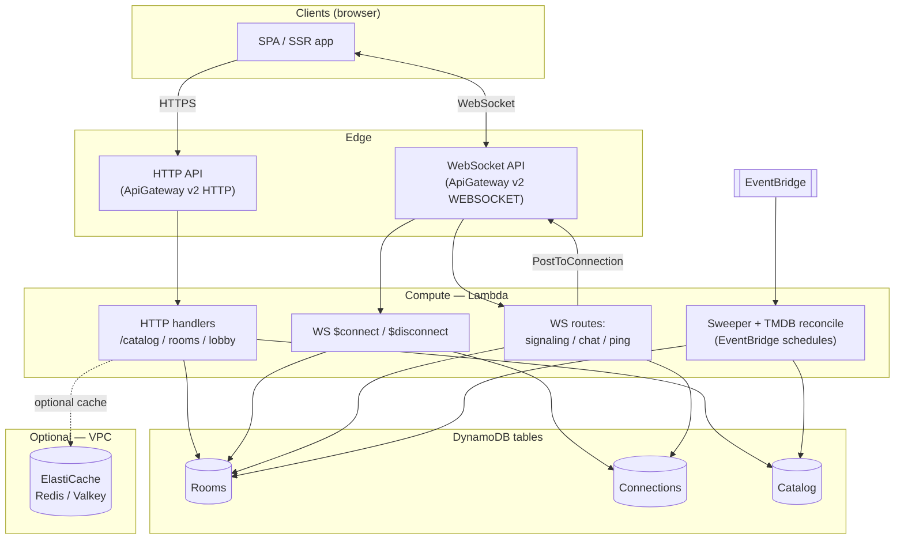

# RiffSync — server-side architecture (draft)

Companion to the repo README: **AWS serverless baseline** for HTTP rooms/lobby, WebSocket realtime, catalog, and housekeeping. **Infrastructure-as-code targets [AWS CDK](https://docs.aws.amazon.com/cdk/) (TypeScript)**; **Lambda** handlers are authored in **`TypeScript`** and run on **Node.js**. Prefer **managed serverless** services everywhere it fits the problem; extend with VPC-only pieces (for example optional ElastiCache) only when required.

Lambda sits behind **API Gateway (HTTP API + WebSocket API)**; durable state is **DynamoDB**.

**ElastiCache** — **Redis OSS–compatible** (ElastiCache for Redis or ElastiCache Serverless for **Valkey** depending on what you enable in account/region) — is **optional**. Use it for read-through caches on **`GET /v1/catalog`**, lobby list snapshots, etc. Any Lambda that talks to ElastiCache joins a **VPC** (ENIs → **cold-start and burst** trade-offs). Cache is **never** authoritative: **DynamoDB** remains the system of record.

Infrastructure-as-code: **deploy with AWS CDK** (`cdk synth` emits CloudFormation). CDK constructs should target **HTTP API (`AWS::ApiGatewayV2::Api`)** / **WebSocket API** primitives and related resources. Lint synthesized templates with **`cfn-lint`** (**[Installing and using](https://github.com/aws-cloudformation/cfn-lint)**) and **`validate_cloudformation_template`** from Cursor’s AWS IaC MCP (**`search_cloudformation_documentation`** for resource properties) when iterating.

**Production web hostname:** **`https://riffsync.tv`** — fan SPA + shareable links (**`.forge/runtime/configuration.md`**). Provision **ACM** + **CloudFront** (or equivalent) **alternate domain** names, **API Gateway** custom domain names if serving APIs from the same brand, and **CORS** allowlists that include this origin.

---

## Serverless resource decisions (baseline)

| Resource | Role |
| --- | --- |
| **API Gateway HTTP API** (`ProtocolType: HTTP`) | BFF JSON: **`GET /v1/catalog`**, curated **`GET /v1/lists`** (when shipped), room create/read/**patch** (current episode / metadata), lobby list, **`GET /v1/health`**, **`GET /v1/webrtc/ice`**, **`POST /v1/webrtc/sfu-token`** (mediasoup join), **`/v1/admin/*`** **operator** APIs (JWT + staff pool / groups — **`architecture.admin.md`**). |
| **API Gateway WebSocket API** (`ProtocolType: WEBSOCKET`) | Realtime paths: `$connect` / `$disconnect`, **WebRTC signaling** (SDP / ICE relay—shape TBD), chat, ping, **`execute-api:ManageConnections`** fan-out. |
| **AWS Lambda** | All synchronous route handlers + **EventBridge** consumers (sweeper, TMDB catalog reconciliation). |
| **Amazon DynamoDB** | **All durable application state:** **rooms**, **connections**, **catalog**, plus **optional** **`profiles`** (fan **`USER#sub`**), **`lists` + memberships** (**`LIST#slug`** editorial rows), append-only **events**/**rollups** for admin reporting (**`architecture.admin.md`**). |
| **Amazon EventBridge** (`AWS::Events::Rule` or **`AWS::Scheduler::Schedule`**) | Schedules for **stale-room housekeeping** and **TMDB reconciliation** batch jobs. |
| **AWS Secrets Manager** | Backend secrets (**TMDB**, etc.). Cognito federated (**Facebook**) app secrets are referenced from pool config (**never** expose to browsers). Staff-only secrets optionally here too. Lambda **`secretsmanager:GetSecretValue`**. |
| **Amazon ElastiCache (optional)** | Redis/Valkey-compatible **cache** — e.g. serialized **full catalog** or lobby denorm. **Invalidate** or **short TTL** when catalog rows change. Not required to ship. |
| **Amazon S3 (optional)** | **Static site** hosting for the SPA, or **offline exports** — **not** part of the catalog **write path** once DynamoDB owns merged rows. |
| **Amazon Cognito user pool (optional)** | Viewer **Facebook** federation (or native sign-up) issuing **JWTs** to **`id_token`** / **`access_token`** for public routes needing **`sub`**. Prefer an **invite-only operator pool** (or separate **app client**) guarding **`/v1/admin/*`**. JWT authorizers on HTTP and optionally WebSocket **`$connect`**; attributes depend on scopes. Secrets referenced from IaC, **never** baked into SPA. **`architecture.admin.md`**. |
| **Amazon CloudWatch** | **Default home for observability:** **metrics** (built-in + **`PutMetricData`** custom), **dashboards**, **alarms**, **Logs Insights** on Lambda/API Gateway/Dynamo log groups. **Operational and product rollups** SHOULD be charted here first; see **Observability** below. |

**Out of scope for this baseline:** **ECS/Fargate**, or alternative WebSocket stacks — API Gateway + Lambda is the default. **Exception:** **mediasoup SFU** runs on a **shared-account EC2** (**`RiffSyncSfu`**): **`POST /v1/webrtc/sfu-token`** (Lambda) mints short-lived join JWTs; browsers connect **`wss://`/`ws://`** to the SFU for RTP. Coturn TURN remains on separate shared EC2 (**`RiffSyncTurn`**).

---

## Component diagram

**Physical DynamoDB:** **multiple tables** — **Catalog**, **Rooms**, **Connections** (and **Lists** / optional **Events**/**Profiles** when shipped)—see **`.forge/data/persistence_abstractions.md`**. The diagram uses separate nodes for clarity.

---

## Responsibilities by area

| Area | Responsibility |
| --- | --- |
| **HTTP API** | **`GET /v1/catalog`**, **`GET /v1/lists`** (when curated lists ship); room create/read/**update current episode**; **live public** lobby; **`GET /v1/health`**; **`/v1/admin/*`** behind **JWT** for operators (**catalog writes**, **lists**, **reporting**, **user roster**) — **`architecture.admin.md`**. Optional ElastiCache on hot reads. |
| **WebSocket API** | **`$connect` / `$disconnect`** write the **connection → room** mapping; message routes relay **signaling** for admin→guest WebRTC, plus **chat**, **ping**, and **room metadata** updates in DynamoDB where durable state is required—then **`PostToConnection`** fan-out as appropriate. |
| **DynamoDB (rooms)** | Source of truth: **current** catalog episode / `videoId` (**admin-updatable**), **`hostSub`** (**Cognito `sub`** of creator), **`playbackExpectation`**, **`lastActivityAt`**, **`roomId`**, optional flags for **broadcast lifecycle / visibility**. Admin capability belongs only to principal **`JWT.sub === hostSub`**; **no guest promotion / reclaim token** in MVP. |
| **DynamoDB (connections)** | **`connectionId → roomId`** (and optional **`sessionId`**) for targeting fan-out and teardown. |
| **DynamoDB (catalog)** | Canonical **`youtubeVideoId`**, **`youtubeWatchUrl`**, **`title`**, **`era`**, **`id`**, optional curator hints; reconcile **writes** TMDB-aligned **`tagline`**, **`posterImageUrl`**, **`backdropImageUrl`**, **`tmdbMovieId`**, **`tmdbArtworkSyncedAt`** plus Dynamo-only copy/paths (**`tmdbOverview`**, **`tmdbPopularity`**, raw poster/backdrop paths) per **`architecture.catalog-images.md`**. TMDB **`original_title`** / **`title`** are **not** persisted — catalog **`title`** is source of truth for display. Bootstrap **seed** (**`data/catalog/episodes.json`**) conforms to **`catalog.schema.json`** — not every Dynamo attribute need appear in git. |
| **Sweeper / TTL** | Remove or hide stale lobby entries (**EventBridge → Lambda**; **Dynamo TTL** where appropriate). |
| **Catalog enrichment (TMDB)** | Scheduled **Lambda** reads catalog items, calls TMDB per **`docs/contracts.tmdb.md`**, **updates DynamoDB** — **`docs/architecture.catalog-images.md`**. |
| **Identity (optional)** | **Cognito** + **Facebook IdP**: fan JWT validates **`sub`** on **`POST /v1/rooms`**, **`PATCH`/`PUT`** playback mutations, and **publisher** WebSocket paths. **`GET /v1/catalog`** stays **unauthenticated**. Anonymous **`sessionId`** suffices for **guest** lobby/read/chat (**`authorization.md`**). Staff **`/v1/admin/*`** unchanged (**invite-only** pool). |
| **Operator admin (optional)** | **`/v1/admin/*`** — **staff Cognito JWT** (**invite-only**, MFA ideally), **`cognito-idp:ListUsers`** on fan pool for **registered-users** roster, Dynamo writers for catalog + curated lists + reporting reads. Full surface and data sketches: **`architecture.admin.md`**. |
| **ElastiCache (optional)** | Reduce Dynamo read load and latency for **catalog** and optionally **lobby**; **VPC** Lambda + security groups to cluster/serverless cache endpoint. |
| **Observability** | **CloudWatch-first** — built-in service metrics, **`PutMetricData`** / **EMF** custom business metrics, **dashboards**, **alarms**, **Logs Insights** (**see Observability below**). Reporting charts live in **AWS** by default. |

---

## Observability (AWS / CloudWatch-first)

RiffSync assumes **charts, alarms, and most reporting** are satisfied **inside AWS** without a separate APM vendor unless you later add one.

| Layer | Use |
| --- | --- |
| **Built-in** | **Lambda** (errors, duration, throttles, concurrent executions), **API Gateway HTTP + WebSocket** (4xx/5xx, latency, count), **DynamoDB** (RCU/WCU, **`UserErrors`**), **EventBridge** invocation success — compose into **[CloudWatch dashboards](https://docs.aws.amazon.com/AmazonCloudWatch/latest/monitoring/cloudwatch_dashboards.html)**. |
| **Custom metrics** | Lambdas call **`cloudwatch:PutMetricData`** (or **[Embedded Metric Format](https://docs.aws.amazon.com/AmazonCloudWatch/latest/monitoring/CloudWatch_Embedded_Metric_Format.html)** in **`stdout`**) under a dedicated namespace (e.g. **`RiffSync/Api`**, **`RiffSync/Reconcile`**, **`RiffSync/Rooms`**) for **domain** signals: rooms created, websocket messages by type, reconcile **processed/failed/skipped** (**`architecture.catalog-images.md`**), TMDB rate-limit hits, **`PostToConnection`** failures, catalog import counts, admin mutations. Use **low-cardinality dimensions** only (`Environment`, `Route`, `Outcome` — avoid unbounded `roomId` as a dimension key). |
| **Logs** | Structured **JSON logs** per Lambda; **[CloudWatch Logs Insights](https://docs.aws.amazon.com/AmazonCloudWatch/latest/logs/AnalyzingLogData.html)** for ad-hoc investigation and **metric filters** → alarms (e.g. spike in `"level":"ERROR"`). |
| **Tracing (optional)** | **AWS X-Ray** on API Gateway + Lambda when you need latency breakdown (TMDB / Dynamo / Cognito) — not required for MVP charts. |
| **Dashboards** | One **“RiffSync operations”** dashboard (health + traffic + errors); optional **“Catalog reconcile”** dashboard (custom metrics); optional **“Realtime / WebSocket”**. **IaC:** **`AWS::CloudWatch::Dashboard`** in the same stack as Lambdas. |

**IAM:** Grant Lambda **`cloudwatch:PutMetricData`**. **`PutMetricData`** is often authorized on **`Resource: *`** in AWS; tighten with an IAM **condition** on **[`cloudwatch:namespace`](https://docs.aws.amazon.com/service-authorization/latest/reference/list_amazoncloudwatch.html)** (e.g. restrict to **`RiffSync/...`**) when your org’s policy language allows it — otherwise enforce **namespace prefixes in code review**.

Operator-facing **admin HTTP** reporting endpoints (**`architecture.admin.md`**) remain **optional** for drill-down or CSV export; **canonical charts** for uptime, volumes, and reconcile health should be **CloudWatch** so on-call and stakeholders use one console.

---

## Delivery pipeline (GitHub Actions)

- **CI:** GitHub Actions runs tests, **`cdk synth`**, and lint on **pull requests** (recommended).
- **Production:** **Manual** **`workflow_dispatch`** deploys **`main`** on demand. Prefer **OIDC** from GitHub → AWS over static access keys.
- Full workflow layout: **`.forge/operations/build_packaging.md`** and **`.forge/operations/deployment_environments.md`**.

---

## IaC & permission notes

Aligned with **[`AWS::ApiGatewayV2::Api`](https://docs.aws.amazon.com/AWSCloudFormation/latest/TemplateReference/aws-resource-apigatewayv2-api.html)** and the **[WebSocket API guide](https://docs.aws.amazon.com/apigateway/latest/developerguide/apigateway-websocket-api-overview.html)**.

| Topic | Notes |
| --- | --- |
| **Lambda ← API Gateway** | Declare **`AWS::Lambda::Permission`**: **`Action`**: `lambda:InvokeFunction`, **`Principal`**: **`apigateway.amazonaws.com`**, **`SourceArn`** scoped to this API’s **`execute-api`** ARN ([**Lambda permissions**](https://docs.aws.amazon.com/lambda/latest/dg/lambda-permissions.html)). |
| **`PostToConnection` broadcast** | WebSocket handler IAM needs **`execute-api:ManageConnections`** on **`…execute-api:…/@connections/*`** ([**@connections API**](https://docs.aws.amazon.com/apigateway/latest/developerguide/apigateway-how-to-call-websocket-api-connections.html)). |
| **`AWS::Events::Rule` / Scheduler** | EventBridge **`rate()` / `cron()`** (or **`AWS::Scheduler::Schedule`**) invoking Lambda requires **`events.amazonaws.com`** (**or Scheduler principal**) **`lambda:InvokeFunction`** permission ([**Events rule**](https://docs.aws.amazon.com/AWSCloudFormation/latest/TemplateReference/aws-resource-events-rule.html)). |
| **DynamoDB TTL** | **`TimeToLiveSpecification`** on TTL attribute — deletes are **eventual**; keep **`lastActivityAt`** for live queries ([**TTL**](https://docs.aws.amazon.com/amazondynamodb/latest/developerguide/TTL.html)). |
| **`cognito-idp` (admin Lambda)** | Admin roster uses **`ListUsers`** / **`AdminGetUser`** on **fan-only** pools with IAM restricted to **`Resource:`** (`arn:aws:cognito-idp:…:userpool/<fanpoolid>` — no `*`). Separate policy from Lambda code that edits Dynamo. |
| **Secrets Manager** | TMDB secret; Lambda **`secretsmanager:GetSecretValue`** ([**retrieve**](https://docs.aws.amazon.com/secretsmanager/latest/userguide/manage_retrieve-secret.html)). |
| **ElastiCache** | Lambda in **VPC** subnets that reach the cache; security group allows client port; expect **longer cold starts**. Prefer **subnet groups** documented for [ElastiCache](https://docs.aws.amazon.com/AmazonElastiCache/latest/dg/elasticache-intro.html); consider **Serverless** cache to defer cluster sizing. |
| **CloudWatch custom metrics** | Lambdas emitting **`PutMetricData`**: **`cloudwatch:PutMetricData`** + namespace **condition** where possible; keep **metric dimensions** low-cardinality. |
| **IaC tooling** | **`cfn-lint`**; Cursor AWS IaC MCP **`validate_cloudformation_template`**, **`search_cloudformation_documentation`**, and the **[CloudFormation resource reference](https://docs.aws.amazon.com/AWSCloudFormation/latest/TemplateReference/aws-template-resource-reference.html)**. |

---

## When to add ElastiCache

Add when **CloudWatch** shows **sustained hot reads** on catalog or lobby (RCU cost, p99 latency) and a **short-lived cache** fits your consistency model — not as default complexity on day one.
